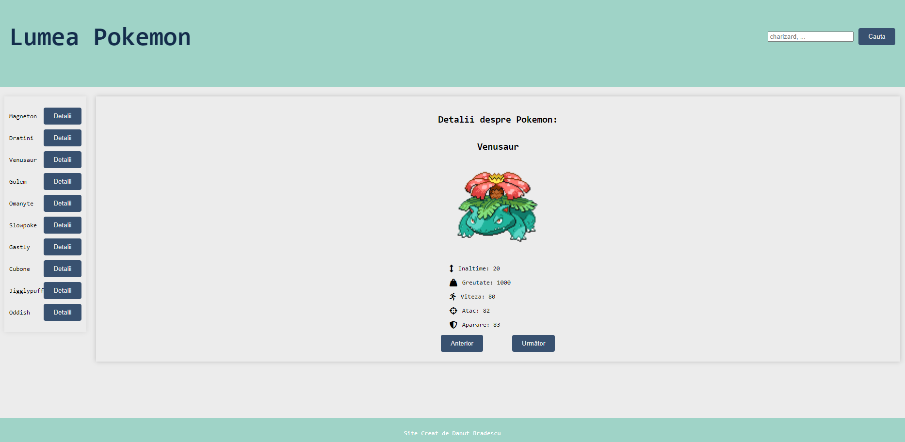

### Pokemon API Project
 - This project was created with the Pokemon API.

### Navigate Forward and Backward in the Pokemon List
 - Implemented functionality to navigate forward to view the next list of Pokemon.
 - Implemented functionality to navigate backward to return to the previous list of Pokemon.
### Pokemon Search
 - Created search functionality to find a Pokemon based on its name.
 - Updated the API call with the entered variable to display details of the searched Pokemon.
### Display Pokemon Details
 - Added functionality to display specific details for each Pokemon.
 - Used the URL variable to retrieve detailed data for the searched Pokemon.
### Examples of Pokemon Details
 - Displayed some specific data for Pokemon (such as type, height, weight, etc.).
### How to Use the Project
1. Clone this repository locally: git clone https://github.com/danutbradescu/pokemon-api-project.git
2. Run the project locally using a development server or open index.html in a browser.
